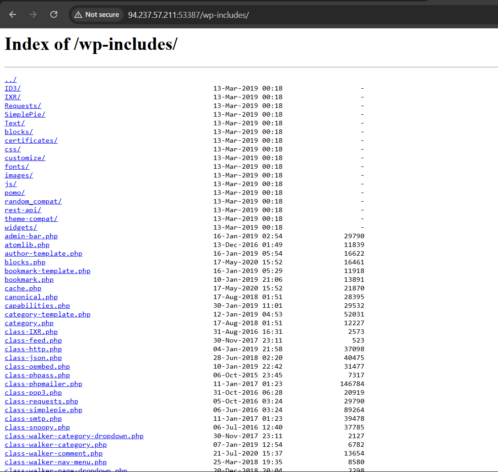

# Directory Listing

##  What I Did
Tested a web server for **Directory Listing** vulnerability by navigating backward through file paths found in the page source (`Ctrl+U`). This exposed hidden backend folders that should not be publicly accessible.

---

##  Tools Used:
- Vulnerable web site
- View Page Source 
- Burp Suite (optional for request inspection)

---

##  Screenshot – Exposed Directory 


---

## Steps

### 1. Identified File Path from Page Source

While viewing the source of the website, found a file path like:
```
https://www.example.com/themes/custom/site/assets/img/logo.png
```

This hinted that a `themes` directory (and subfolders) might exist on the server.

---

### 2. Removed Parts of the Path Step-by-Step

Manually removed parts of the URL and visited each level:

- `/themes/custom/site/assets/img/`
- `/themes/custom/site/assets/`
.
.
- `/themes/`

 At one level, the server **did not return a 403 Forbidden** or redirect — instead, it **listed all files and folders** present in that directory.

---

### 3. Confirmed Directory Listing Vulnerability

If the server allows browsing folder contents (without an `index.html` file or access restriction), it's vulnerable to **Directory Listing**. This can expose:

- Source code files
- Uploaded documents
- Backup configs
- Admin panels or development folders

---

## Fixes:

### 1. **Disable Directory Browsing**
   In Apache: `Options -Indexes` (inside `.htaccess` or `httpd.conf`)

### 2. **Add Index Files**
   Create an `index.html` in every exposed folder to block listing

### 3. **Use Access Controls**
   Restrict folders via `.htaccess`, `robots.txt`, or firewall rules

### 4. **Minimize Public Exposure**
   Move sensitive assets to non-web-accessible locations
