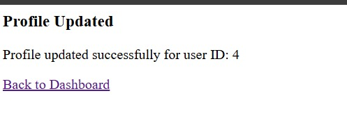

# IDOR 

## What I Did  
Tested for insecure access controls by manipulating user ID parameters. Was able to view or modify records belonging to other users by changing the `user_id` field in a POST request — a classic **IDOR vulnerability**.

---

## Tools Used
- Burp Suite

---

## Screenshot – IDOR Triggered


The page confirms that profile changes were saved for `user ID: 4`, despite being logged in as a different user — this confirms IDOR.

---

## Steps

### 1. Logged in as a Normal Student
Logged in using valid credentials as a student and navigated to the profile update page.

### 2. Intercepted the Request in Burp Suite
Captured the request sent to the server while submitting a profile update. It included a field:
```
user_id=3
```

### 3. Changed the Parameter to Another User’s ID
Manually changed the ID value to:
```
user_id=4
```

Submitted the request again, received a **success message**, and data for another user was altered or accessed.

---

## Horizontal vs. Vertical Privilege Escalation

| Type        | Description                                                                 |
|-------------|-----------------------------------------------------------------------------|
| **Horizontal** | Accessing another **student’s** data as a student                          |
| **Vertical**   | Trying to access **teacher/principal/admin** data as a student             |

This attack demonstrated **horizontal privilege escalation**.

---

## Fixes from Internship Notes

1. **Object-Level Access Control**
   Always verify that the logged-in user has permission to access the requested object (e.g., user ID).

2. **Avoid Predictable Identifiers**
   Use **hashed** or **randomized tokens** instead of numeric user IDs in URLs or forms.

3. **Session & Token Validation**
   Never trust client-side identifiers alone. Validate ownership on the server using the session.

4. **Use Short-Lived OTPs**
   For accessing sensitive data like documents or grade reports, prompt an OTP or second-factor.

5. **Secure Cookies**
   Mark session cookies as `HttpOnly`, `Secure`, and `SameSite=Strict` to prevent XSS-based hijacking.
