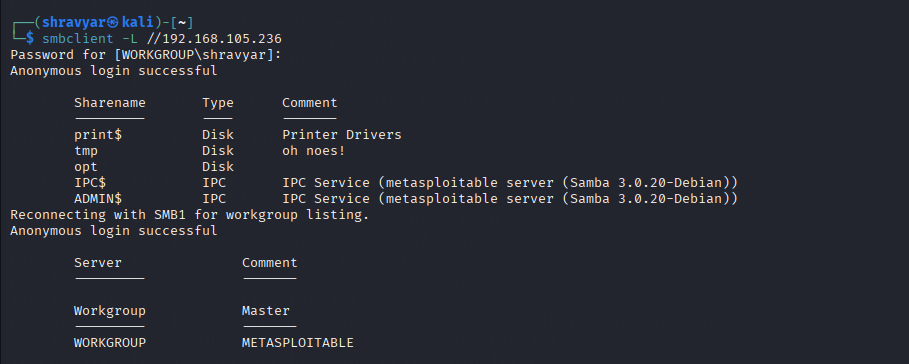

# SMB Enumeration – Metasploitable2 Lab

##  What I Did
Performed **SMB Enumeration** on a vulnerable Metasploitable2 target. Discovered open ports (139 & 445), listed available shares using `smbclient`, and explored shared directories both anonymously and using known credentials.

---

##  Tools Used
- `nmap`
- `enum4linux`
- `smbclient`
- `Metasploitable2 (target system)`

---

## Screenshot – Open Ports (139, 445)


---

## Steps

### 1. Scanned for Open Ports

 Confirmed SMB is running:
- Port 139 → NetBIOS Session Service
- Port 445 → Microsoft-DS Active Directory / SMB

---

### 2. Ran Enum4linux to Get Share Info

 Revealed:
- OS version
- Share names
- User list
- Anonymous login possibility

---

### 3. Connected Using `smbclient`

#### List available shares:

Got list of share names like `tmp`, `opt`, `ipc$`

---

### 4. Accessed a Share

Anonymous login attempt:

```bash
smbclient //<target-ip>/<sharename> -N
```

---

## Screenshot – Logged into Share & Explored


Used commands like:
```bash
ls
cd foldername
get filename
put shell.php
```

 Navigated directories, searched for `passwd`, or uploaded a test file.

---

## Key SMB Concepts from Internship

| Action                 | Tool Used      |
|------------------------|----------------|
| Port Scan              | `nmap`         |
| OS/Share/User Enum     | `enum4linux`   |
| Access Share (Anon)    | `smbclient -N` |
| Authenticated Access   | `smbclient -U` |

---

## Fixes:

### 1. **Restrict Share Access**
   Remove anonymous access from sensitive shares.

### 2. **Least Privilege**
   Users should only see what they need. E.g., `tmp` instead of full `/`.

### 3. **SMB Signing + Encryption**
   Prevent MITM attacks on corporate networks.
