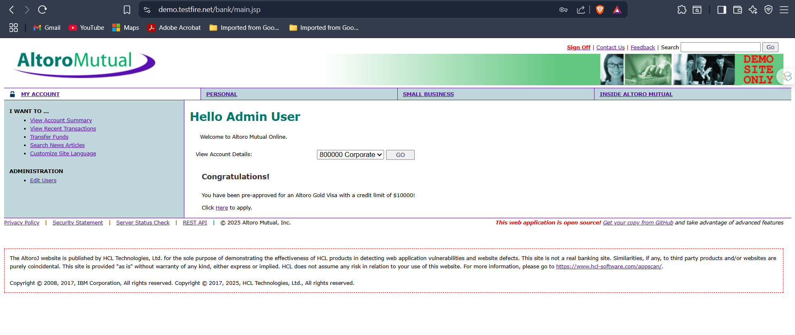

# SQL Injection – Login Bypass

##  What I Did
Tested SQL Injection on the **Altoro Mutual login page**. Used manual payloads like `'--` and error/time-based payloads to bypass authentication and extract DB info.

---

##  Tools Used
- SQL vulnerable site
- Browser (manual testing)
- Burp Suite (optional for request capture)

---

##  Screenshot – Admin Panel Access

---

##  Steps

### 1. Tested Login Page

### 2. Tried SQL Bypass using Comment Injection:
Injected:

Username: admin'--
Password: (anything)
 This works by closing the SQL query and commenting out the rest.

### 3. Error-Based SQLi
Injected:

Username: ' OR '1'='1
Password: test
 Application showed error or allowed access depending on backend logic.

### 4. Time-Based SQLi
Injected:

Username: ' OR SLEEP(5)--
The server response was delayed, confirming SQL query execution.

## Fixes:

### 1. Sanitize SQL Inputs

Escape characters like ' and --

Use server-side input validation

### 2. Use Whitelisting

Reject unexpected input types

Blacklists are weak (can be bypassed using encoding)

### 3. Use Prepared Statements

Bind user input as parameters, not as raw SQL
