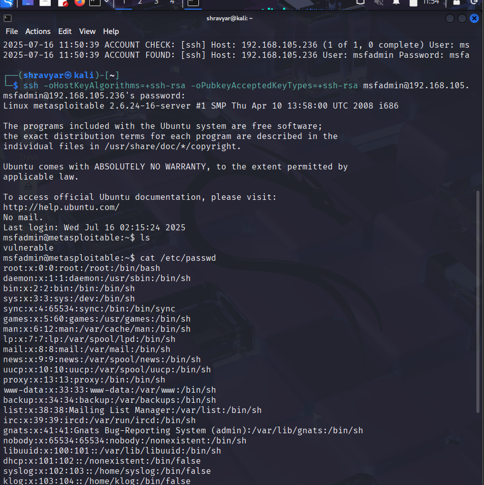

# SSH Access via Brute Force – Metasploitable2 (CTF)

##  What I Did
Targeted an exposed **SSH service (port 22)** on a vulnerable CTF machine. Used `medusa` to perform a brute-force login attack with a list of common usernames and passwords. Successfully gained shell access as `msfadmin`, then accessed `/etc/passwd` to confirm full login.

---

## Tools Used
- Metasploitable2 (target machine)
- `nmap` (to verify SSH service)
- `medusa` (for brute-force attack)
- `nano` (for wordlist creation)
- SSH client (for remote shell access)

---

## Screenshot – `/etc/passwd` Access via SSH  

---

## Steps

### 1. Scanned the target to confirm SSH is running  
Used a service scan to detect open **port 22** and confirm it was SSH. This indicated a remote shell might be accessible.

### 2. Created Username & Password Lists  
Manually prepared two text files: one with **usernames** (`user.txt`) and another with **passwords** (`password.txt`) — common practice in brute-force testing.

### 3. Ran Medusa for SSH Brute Force  
Executed `medusa` to attempt all combinations from the wordlists. After several tries, successfully authenticated as the default user `msfadmin`.

Login was successful — no lockouts or rate-limiting in place.

---

### 4. Gained Remote SSH Access  
Logged in using the valid credentials over SSH. Used specific options to ensure older key exchange algorithms (`ssh-rsa`) were accepted — a useful trick for older VMs like Metasploitable2.

---

### 5. Verified Full Shell Access  
Once inside, navigated the file system and read `/etc/passwd` to confirm user-level access. This validated a complete compromise of the target’s SSH service.

---

## Fixes:

### 1. **Disable SSH for Root**
   Restrict login to specific users only

### 2. **Rate Limiting**
   Enable fail2ban or sshguard to prevent brute-force attacks

### 3. **Key-Based Authentication**
   Replace password-based login with SSH key pairs

### 4. **Use Strong Passwords**
   Prevent dictionary attacks using basic wordlists

### 5. **Audit Logs Regularly**
   Monitor `/var/log/auth.log` for repeated failed attempts

---
