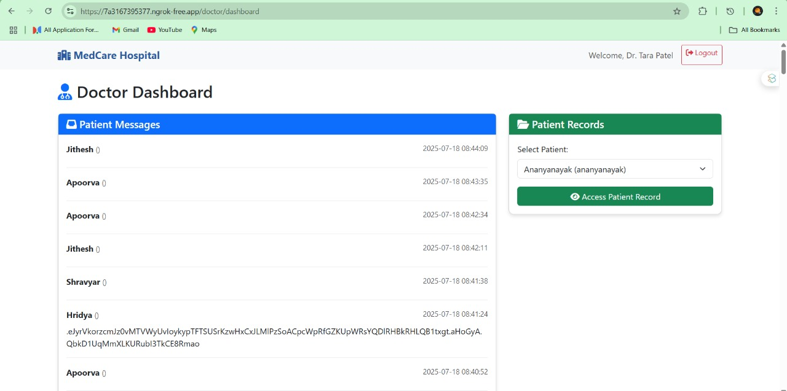

# XSS

##  What I Did
I tested for **Stored Cross-Site Scripting (XSS)** on a custom hospital dashboard. Injected JavaScript inside the patient message input, and it got executed across all user dashboards (Stored XSS).

---

##  Tools Used
- XSS vulnerable site
- JavaScript payloads
- webhook.site 
- DevTools

---

## Screenshot – Stored XSS Triggered

---

##  Steps

### 1. Injected the payload in “Patient Message”:

Used a Javascript payload

### 2. Used Cookie Stealer

Used a js payload which secretly sent the cookies of the doctor user to my webhook endpoint.

3. Checked DevTools → Application → Cookies
Grabbed the session JWT from the browser

Used jwt.io to decode the token and modify if needed

## XSS Types Explored During Internship

### 1.Reflected-Payload executes immediately 
### 2.Stored-Payload is saved in DB, affects all users
### 3.DOM-Based	Executed via JS logic, not saved on server

## Fixes from Internship Notes
### 1.HttpOnly Cookie
Prevent JavaScript from reading cookies

### 2.Whitelist Inputs
Only allow valid characters, block <script> and JS tags

### 3.Use Proper Escaping
Encode HTML special chars before rendering

### 4.Enable SameSite + Secure Flags
Prevents cross-origin and insecure transfers
